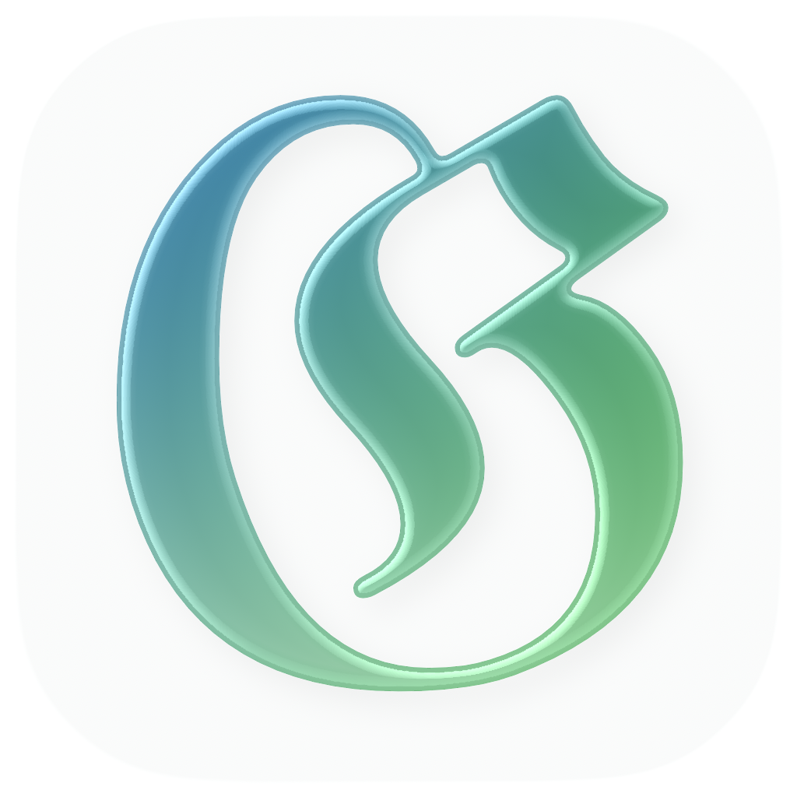

# Glyph Folio

Personal Typst note-taking system. Write notes in Typst markup on your Mac or iPhone, compile to PDF, and keep everything in sync through a self-hosted server — or stay fully offline with local storage.

## Features

- **Typst editor** — write in Typst markup with syntax highlighting; headings, bold, italic, code, math, and more all coloured as you type
- **PDF compilation** — compile any note to a PDF via the sync server; preview inline or export
- **Tag system** — add `// @tags: tag1, tag2` to any note; browse and filter by tag in the Explore tab
- **Slash commands** — type `/` anywhere to open a command palette with headings, lists, code blocks, math, checkboxes, wiki links, and more
- **Wiki links** — link notes with `[[Note Title]]`; the graph view visualises connections
- **Three-way sync** — desktop and iOS stay in sync through your own server with 3-way merge conflict resolution
- **Local mode** — work entirely offline; notes are stored on device with no server required
- **Separate stores** — local and server notes are kept in separate directories so switching modes never mixes them

## Port

The server listens on **port 3001** by default. Override with the `PORT` environment variable:

```
PORT=8080 node dist/index.js
```

## Install

### Server

Requirements: **Node.js 20+** and **Typst** on your PATH.

```bash
git clone https://github.com/XWBarton/glyph-folio.git
cd glyph-folio/server
npm install
npm run build
node dist/index.js
```

The server stores notes in `./data/notes/` relative to where you run it.

#### Auth (optional)

```bash
AUTH_TOKEN=your-secret-token node dist/index.js
```

Leave `AUTH_TOKEN` unset for open access on a trusted local network.

#### Behind a reverse proxy or Cloudflare Tunnel

No extra configuration needed. Point your tunnel or proxy at `localhost:3001` (or your custom port).

### Desktop app

Requirements: **Node.js 20+**.

```bash
cd glyph-folio/desktop
npm install
npm run build
```

Or run in development mode:

```bash
npm run dev
```

### iOS app

Open `ios/GlyphFolio.xcodeproj` in Xcode and build to your device or simulator. In **Settings** inside the app, enter your server URL and auth token (if set).

## Keep running (PM2)

```bash
npm install -g pm2
cd glyph-folio/server
PORT=3001 pm2 start dist/index.js --name glyph-folio
pm2 save
pm2 startup
```

`pm2 startup` prints a `sudo env ...` command — copy and run it to register with systemd.

Useful commands:

```bash
pm2 logs glyph-folio      # tail logs
pm2 restart glyph-folio   # restart
pm2 stop glyph-folio      # stop
```

## Update

```bash
cd glyph-folio
git pull --ff-only
cd server && npm install && npm run build
```

Then restart the server.

## Related

| | |
|---|---|
| **[Glyph Quorum](https://github.com/XWBarton/glyph-quorum)** | Real-time collaborative browser based Typst editor: multiple people, shared documents, live cursors |
| **[Glyph](https://github.com/XWBarton/glyph)** | Local desktop typst editor offline, single-user, no server needed. |

---

## Development

Run the server and desktop app together:

```bash
cd glyph-folio
npm install
npm run dev
```

Server runs on port 3001, desktop opens via Electron with hot reload.

---

Found this useful and want to help support maintenance?

<a href='https://ko-fi.com/X8X21WPZ2R' target='_blank'></a>
